#### 本文只针对windows用户
** 重要** 在安装phpStudy的时候，安装路径不要有中文，安装的文件夹不要有空格；否则，在启动apache或者mySql的时候会出现失败的情况。
### 一、安装composer并配置php环境变量
1.1、 Laravel 使用 Composer 来管理代码依赖。所以，在使用 Laravel 之前，请先确认你的电脑上安装了 Composer。如果没有安装，请按照一下步骤安装。        
1.2、 下载并且运行[Composer-Setup.exe](https://getcomposer.org/Composer-Setup.exe),它将安装最新版本的 Composer。双击开始安装：
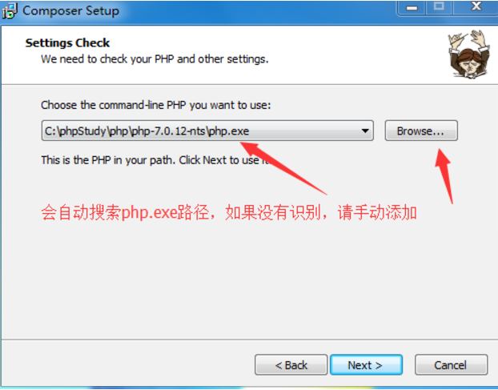  
这里会自动搜索 php.exe 路径, 如果找不到，则手动添加路径。点击next直到安装结束  
1.3、 添加php.exe环境变量，[这里以win10系统为例](http://jingyan.baidu.com/article/ad310e80d2ebe31848f49e59.html)：  
1.3.1、 右键开始菜单--选择控制面板  
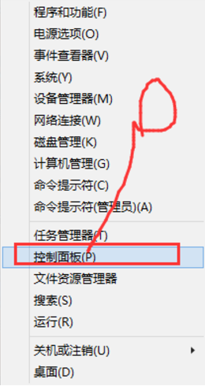  
1.3.2、 切换到大图标模式   
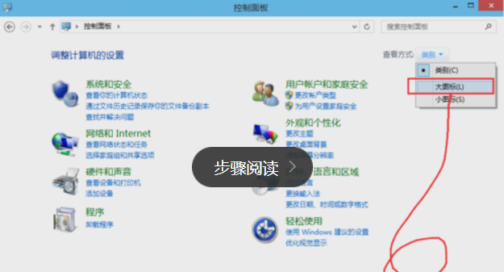  
1.3.3、 选择系统    
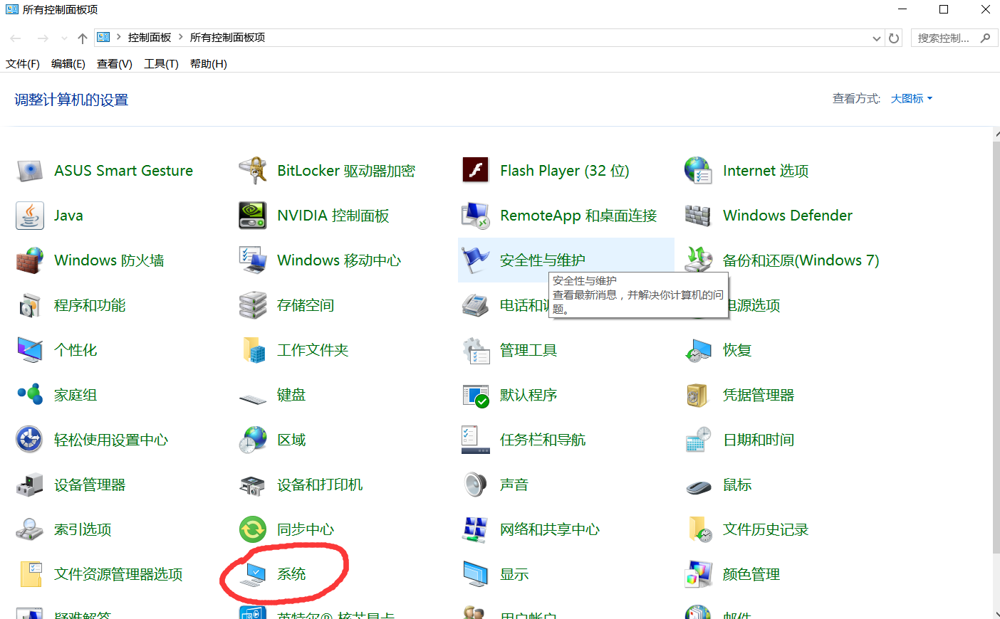      
1.3.4、 选择高级系统        
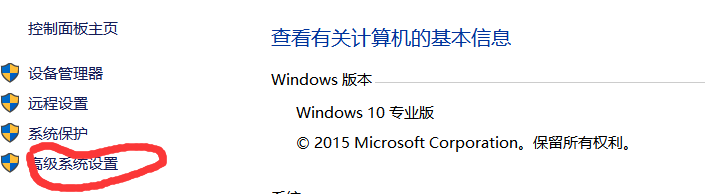       
1.3.5、 点击环境变量        
1.3.6、 点击系统变量下面的新建        
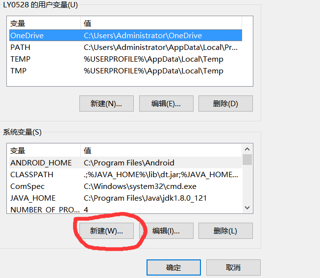      
1.3.7、 输入环境变量信息      
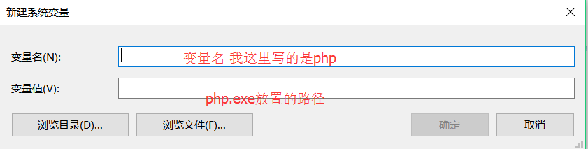      
1.3.8、 点击确定保存，打开cmd 输入 php -v 看是否配置正确 我这里是7.0.12       
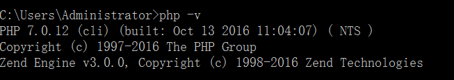
### 二、开启openssl扩展
2.1、 在PHP目录下，打开php.ini文件，去掉extension=php_openssl.dll前面的分号(;)   
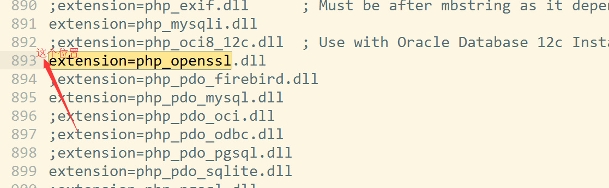      
2.2、 下载[composer.phar](https://getcomposer.org/composer.phar)并放到PHP目录下，在PHP目录下新建composer.cmd， 内容为

    @php "%~dp0composer.phar" %*

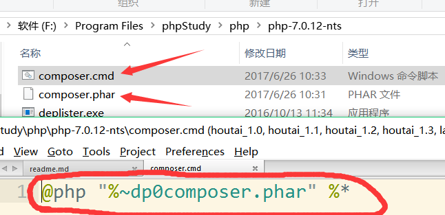      
2.3、 保存后，运行这个文件，打开cmd，输入 composer -V(是大写的哟)  查看是否成功
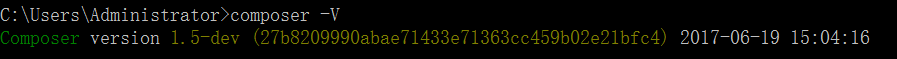  
2.4、 国内网速有限 可以安装 Packagist 为国内镜像

    composer config -g repo.packagist composer https://packagist.phpcomposer.com
    
到这里我们的composer真正的安装完成了，下面开始安装Laravel
###　三、安装 Laravel
3.1、 使用 Composer 下载 Laravel 安装包

    composer global require "laravel/installer"

请确定你已将 ~/.composer/vendor/bin 路径加到 PATH，只有这样系统才能找到 laravel 的执行文件                    
3.2、 如何添加到PATH？   
3.2.1、 首先让我们回到1.2.5步骤，然后找到PATH选项并双击    
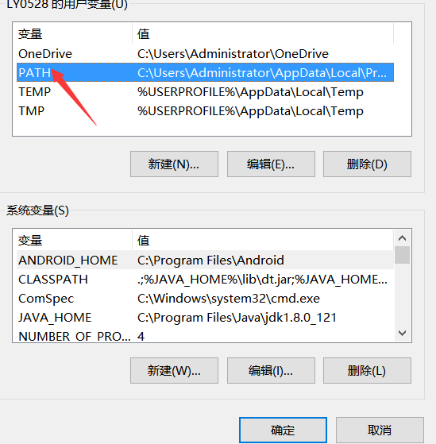      
3.2.2、 点击右边的新建，把你的~/.composer/vendor/bin路径复制粘贴进去，点击确定保存就可以了           
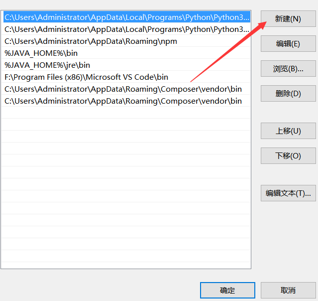   

### 四、安装laravel-admin并配置
1.新建一个项目
    
        laravel new blog //blog是项目名
2.切换到项目目录，在项目目录的命令行中输入

     composer require encore/laravel-admin "1.4.*"

3.在项目目录的.env文件中进行配置

        DB_DATABASE=blog //项目名称
        DB_USERNAME=root //数据库用户名
        DB_PASSWORD=     //数据库密码
4.然后在config/app.php加入ServiceProvider:    

    Encore\Admin\Providers\AdminServiceProvider::class
5.然后运行下面的命令来发布资源：

    php artisan vendor:publish --tag=laravel-admin

6.在文件config/admin.php中，可以在里面修改安装的地址、数据库连接、以及表名。   
然后运行下面的命令完成安装：

    php artisan admin:install
7.接下来还需要配置一些文件：         
7.1 在hosts文件中最后一行添加：

        127.0.0.1  blog.com //我的项目文件夹名称是blog

hosts文件的路径:C:\Windows\System32\drivers\etc
7.2 打开Apache中的vhosts-conf配置文件（我用的是phpStudy），添加：

        <VirtualHost blog.com:80> //记得换成你的文件名称和端口号
            DocumentRoot "F:\phpStudy\WWW\blog\public" //记得换成你的文件路径
            ServerName blog.com
        </VirtualHost>

8.启动你的laravel-admin后台管理系统      
8.1、第一种方法：      
    打开你的phpStudy，启动Apache和MySQL之后，打开浏览器，在浏览器中输入

        blog.com/admin
8.2、第二种方法：      

    使用php artisan serve开启服务，启动服务后，会在命令行中生成一个端口号，在浏览器打开 http://localhost:生成的端口号/admin/ ,使用
    用户名 admin 和密码 admin登陆.

### 五、如何修改laravel-admin默认样式
一、修改laravel-admin模板字体图标         
1.如何修改laravel-admin模板自带字体图标？

    由于字体图标都有一个为fa的class类名。我们只需要在public/packages/admin/font-awesome/css和vendor/encore/laravel-admin/assets
    /font-awesome/css文件夹下的css文件中给fa类名下增加一个color属性即可修改所有字体图标的颜色。若是修改某一个字体图标的颜色，我们只需
    要找到这个字体图标对应的class类名，以同样的方法在其class类名下增加color属性即可。这种方法改动较大，不推荐这种做法。        
二、在laravel-admin模板中自定义皮肤   
1.如何给登录界面增加背景图片？ 

    首先，同样在public/admin/AdminLTE/dist/css/AdminLTE.min.css文件中找到login-page和register-page类名(类名若是有变，就打开调试工
    具查看正确的类名)，把background的属性值换成你想要的背景图片的路径，并设置background-size:cover属性。修改登录页面中的其他样式也
    是以同样的方法进行。            
2.如何修改模板登录界面的标题？  

    修改config/admin.php文件中的name项即可           
3.如何修改模板的logo和mini-logo标题？  

    修改config/admin.php文件中logo项和mini-logo项即可     
4.如何修改用户名头像？     

    单击右上角头像或者用户名，选择设选项，在里面可以修改用户名和头像，还有密码         
5.如何定义自己的皮肤？

    首先在public/admin/AdminLTE/dist/css/skins文件夹下新建自己的皮肤名称，后缀css，在css文件中定义一些class类名的background样式(如：
    logo、navbar、main-sidebar、sidebar-menu、active、treeview-menu。若是class类名有变，那就打开调试工具查看正确的类名)。然后在
    config/admin.php中把当前皮肤的名修改成你自己定义的皮肤名。然后刷新，就会发现自定义的皮肤已经生效。 